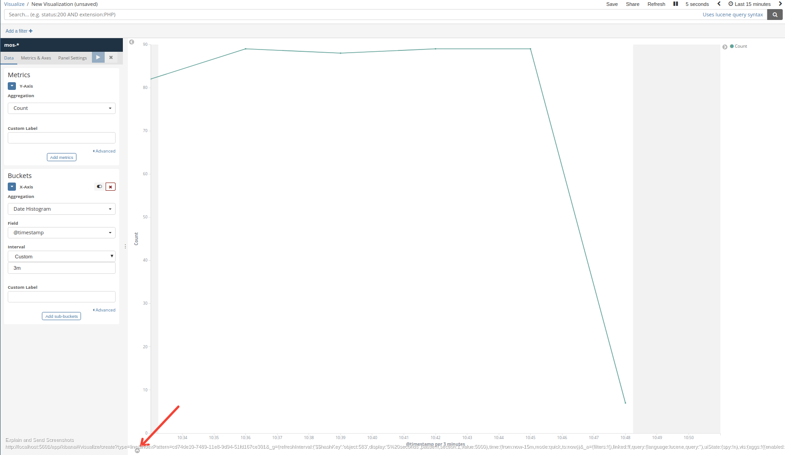
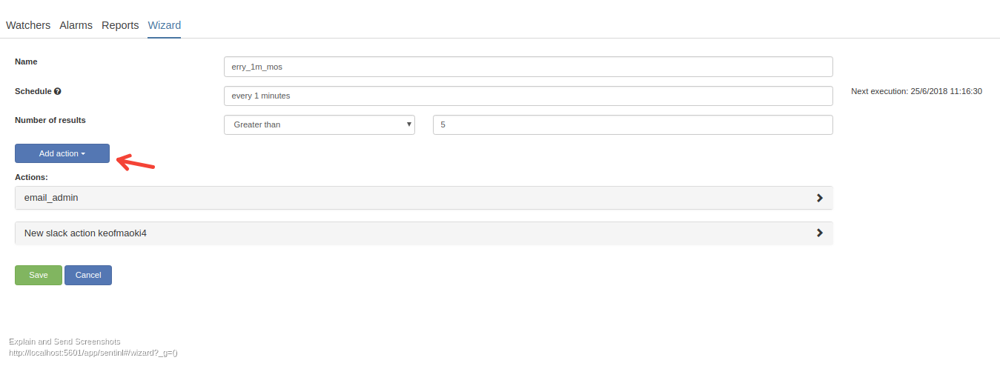

# Sentinl watcher tutorial 

- [Sentinl documentation](http://sentinl.readthedocs.io/en/latest/)
- [Sentinl github](https://github.com/sirensolutions/sentinl)

## What is a watcher

- A watcher watches over your data, and based on your queries it will trigger an alert.
- How advanced an watcher is relies upon the user or admin of the system.

## How to use Sentinl watchers

- A Sentinl watcher could be used in several ways, the most intuitive way is to create one directly from a visualization or from a visualization saved in your dashboard.
  - In order to do this, you need to create a visualization of your data.
  - My data in all of the tutorials is a randomly generated ip, (Literally bash RANDOM and a timestamp).

- Important aspects:
	- Creating watchers from a visualization:
	- Visualization SPY [Documentation](https://www.elastic.co/guide/en/kibana/current/vis-spy.html)
	
	- Visualization SPY tab , Request, Response, Statistics]")
	- Watcher tab of Visualization SPY contains a single button which says "Set Alarm".
	- When that button is pressed the query which is generated from the visualization you are currently browsing is passed into a Watcher. (In order to see your query just switch to the request tab)
	- There is also a possibility to browse the response from the elasticsearch server, this could be useful when creating more advanced alerts that involves using JavaScript.

## First watcher/alarm

1. From the Visualization SPYs watcher tab click "Set Alarm"
1. You will be presented with a Sentinl watcher wizard.
	- This wizard uses the queries generated from your visualization in it's watcher operations (request tab)
	- The query is based on what you have selected in the time filter, but it will turn these timestamps into relative fields (e.g. "gte":"now-15m/m", "lte":"now/m")
1. 
	- Whether this interface looks like this or not is hard to predict, but we've submitted issues and pull requests with our desires. One of them is the dropdown in which you can specify is;  Is above, Is below and Equals.
1. Specify  a

## Guides and tutorials
- [Threshold alerting](threshold_alert.md)
- [Anomaly alerting](anomaly_alert.md)
- [Cardinality alerting](cardinality_alert.md)
- [Frequently asked questions](FAQ.md)