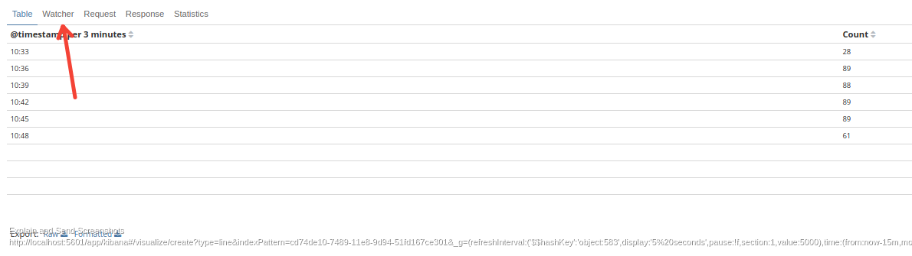
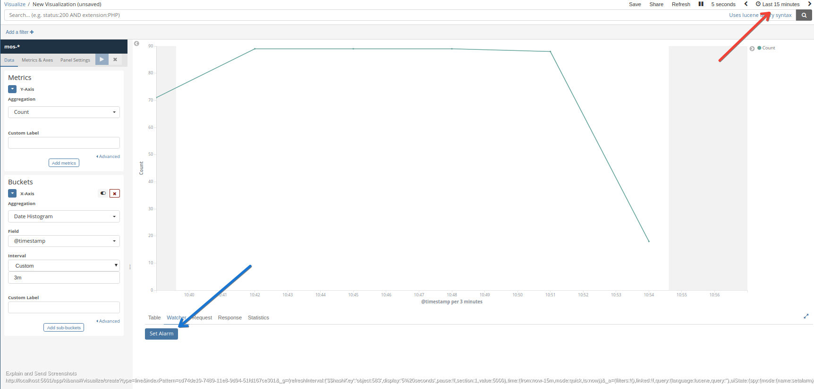
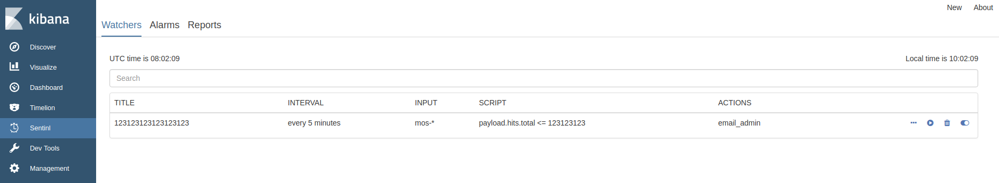
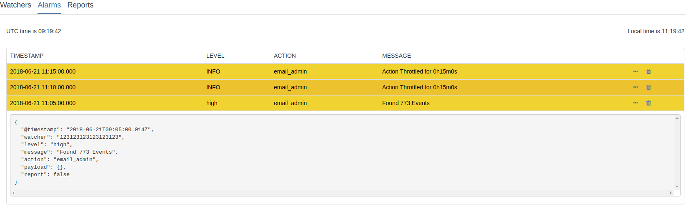
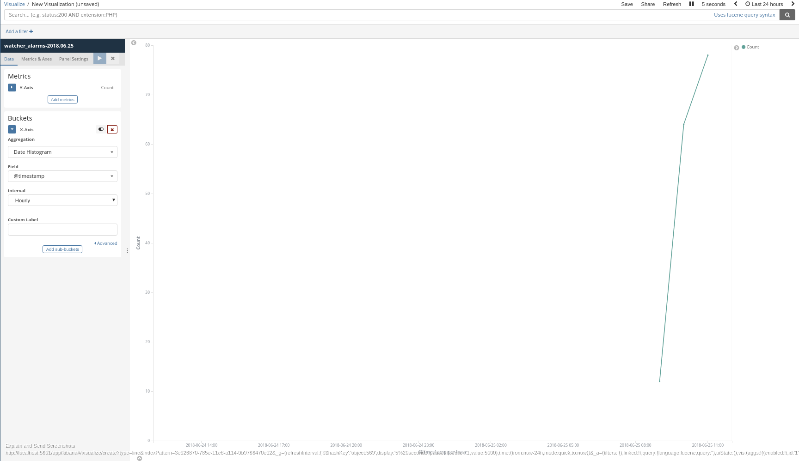
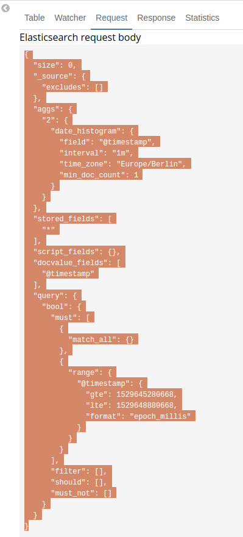
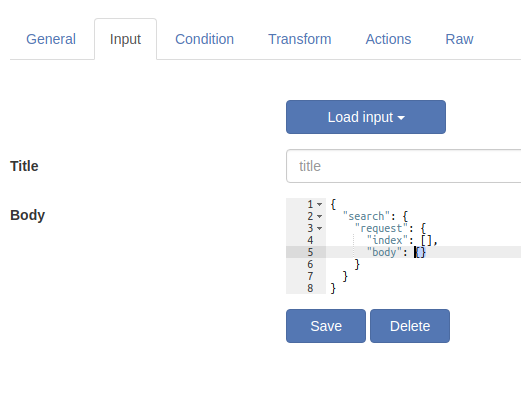
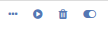
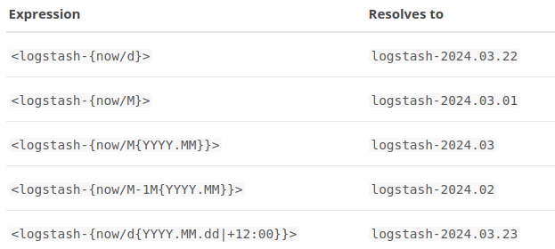

# Sentinl watcher tutorial

- Read before this tutorial
  - [Sentinl documentation](http://sentinl.readthedocs.io/en/latest/)
- Open for issues/improvements
  - [Sentinl github](https://github.com/sirensolutions/sentinl)
  - [This tutorial you are reading now](https://github.com/havlan/mini-sentinl-tutorial)

## Content
- [Versions](#versions)
- [What is a watcher](#what-is-a-watcher)
- [How to use Sentinl watchers](#how-to-use-sentinl-watchers)
- [First Watcher](#first-watcher)
- [Testing input queries](#testing-input-queries)
- [Understanding the Sentinl UI](#understanding-the-sentinl-ui)
- [Watcher administration](#watcher-administration)
  - [Edit watcher](#edit-alarm)
  - [Execute watcher](#execute-watcher)
  - [Delete watcher](#delete-watcer)
  - [Disable watcher](#disable watcher)
- [Date math](#date-math)
- [Guides and tutorials](#guides-and-tutorials)
  - [Threshold alerting](threshold_alert.md)
  - [Anomaly alerting](anomaly_alert.md)
  - [Cardinality alerting](cardinality_alert.md)
  - [Handlebars](handlebars.md)
  - [Frequently asked questions](FAQ.md)
  - [Reports](reports.md)
- Advanced
  - [Testing input queries](#testing_input_queries.md)

## Versions
- This tutorial was created using the following versions of required software
  - Kibana 6.2.4
  - Elasticsearch 6.2.4
  - Sentinl 6.2.4
<!--- - Keep in mind that Sentinl is an open source project, and there is possibly bugs due to the high pace of Elastic and Elastic not keeping backward compatibility for plugins when releasing new versions. -->


## What is a watcher

- A watcher watches over your data, based on your queries and conditions it will trigger an alert.

## First watcher

- The most intuitive way is to create a watcher is directly from a visualization or from a visualization saved in your dashboard.
  - In order to do this, you need to create a visualization of your data and select the desired time range in time filter. (top right corner)

- Important aspects:
	- Creating watchers from a visualization:
	- Visualization SPY in the bottom left corner of the visualization.  [Documentation](https://www.elastic.co/guide/en/kibana/current/vis-spy.html)

	

	- Visualization SPY
  
	- Table tab provides a data overview
	- Watcher tab provides you with an option to create a watcher from a visualization
	- Request tab holds the request used creating the visualization
	- Response tab presents the server response
	- Statistics tab presents basic statistics

#### Step by step
- Create and form your visualization
- Remember that even though the visualization below uses date histograms, it's the time filter (red arrow pointing to it) that specifies the range of the query.
- Press "Set Alarm" (blue arrow)



- You will be presented with a Sentinl watcher wizard.
	- This wizard uses the queries generated from your visualization in it's watcher operations (request tab)
	- The query is based on what you have selected in the time filter, but it will turn these timestamps into relative fields (e.g. "gte":"now-15m/m", "lte":"now/m")
	- Schedule is an important concept of watchers, the range specified in the time filter limits the query, the schedule itself tells the scheduler how often to run this query.
- Add actions of your choice (red arrow)
  - In my example I want to get notified by email and slack every minute when there is more than 5 hits on my query in a now - 15 minutes range
  - I'm limiting email actions to every thirty minutes.
<!--- TODO add image which specifies throttle period of an action -->


- Add actions, condition number, condition operator and schedule.
- Press save and you should be redirected to the Sentinl UI. (The same UI as when you select Sentinl from the menu on the left. See [Understanding the Sentinl UI](#understanding-the-sentinl-ui))
- Keep in mind that this is the easiest way to create a watcher, after creating one it's easy to edit.

## Understanding the Sentinl UI



- The Sentinl UI provides you with the basics of **monitoring**, **creating**, **maintaining**, **updating**, **deleting** and **testing/executing** both watchers and reports.
- In the top right corner of the Sentinl UI there is two buttons, the one you will be using is New, which starts the process of creating a new watcher or reporter.
- When pressing "New" you will be presented with a window/drop down that lets you specify whether it's a new watcher or a new reporter that you wish to create.


#### Monitoring

- The basics of monitoring Sentinl watchers is in the Alarms tab. You can preview the format and looks of your alarms that have been run.



- Timestamp, Level, Action and Message are columns in the table, on the right side of each alarm is the possibility to expand and view its json format with the three dots button and delete the alarm. (**This does not delete watchers.**)
- Alarms are passed to elasticsearch using the ```<watcher_alarm-{now/d}>``` index name.



#### Creating
- In the the top right corner of the Sentinl UI there is two buttons, the one you will be using is **New**, which starts the process of creating a new watcher or reporter.
- When pressing **New** you will be presented with a window/drop down that lets you specify whether it's a new watcher or a new reporter that you wish to create.
- Creating a watcher from scratch is not a simple task, luckily there are ways to avoid manually creating queries.
- Remember when defining the different required fields to create a watcher, it could be useful to save them in order to reuse working queries.
- The visualization SPY is worth using in this case. Just to get the simplest of structure in your manually created alert.
- You could also test your query from the visualization SPY in the kibana dev tools.
- Below is your starting point for manually creating an alert.

```json
{
  "search": {
    "request": {
      "index": [],
      "body": {}
    }
  }
}
```

- It's not much to start with. But using the query from the visualization SPY query tab could speed up things. Below is an example query.

```json
{
"size": 0,
"_source": {
  "excludes": []
},
"aggs": {
  "2": {
    "date_histogram": {
      "field": "@timestamp",
      "interval": "1m",
      "time_zone": "Europe/Berlin",
      "min_doc_count": 1
    }
  }
},
"stored_fields": [
  "*"
],
"script_fields": {},
"docvalue_fields": [
  "@timestamp"
],
"query": {
  "bool": {
    "must": [
      {
        "match_all": {}
      },
      {
        "range": {
          "@timestamp": {
            "gte": 1529645280668,
            "lte": 1529648880668,
            "format": "epoch_millis"
          }
        }
      }
    ],
    "filter": [],
    "should": [],
    "must_not": []
  }
}
}
```
- When merging the template with your query theres still some fields that require input. These are:
  - Index (Elasticsearch index pattern)
    - e.g. ```logstash-2018.06.20```
    - This is an array, so multiple fields are allowed. e.g

```json
"request": {
    "index": [
      "logstash-2018.06.19",
      "logstash-2018.06.20"
    ],
    "body": {"..."}
  }
  ```

  - Relative timestamps could also be used. [Date math](#date-math)
    - ```<logstash-{now-1d/d}>```
    - ```<logstash-{now/d}```
    - Keep in mind that in the Sentinl watcher list they will not appear with the correct date, they will look like they do in the example above. (V 6.2.4)
  - Range in the query
    - The range is converted to a relative field when creating using the visualization spy, but without these are static fields (often epoch timestamps)
    - e.g.

```json
"range": {
        "@timestamp": {
          "gte": 1529645280668,
          "lte": 1529648880668,
          "format": "epoch_millis"
        }
      }
```

  - Would need to be changed to:

```json
"range": {
        "@timestamp": {
          "gte": "now-1h/h",
          "lte": "now/h",
        }
      }
```

  - This is crucial if the goal is to have an alert thats relative and won't expire when the timestamps are not valid anymore.
  - Merging the template with the query from SPY visualization we first need to copy our query, the query is going to be copied into the request body in the watcher creation.
  - Copy the query



  - Navigate to watcher creation
    - If you copied the entire query as shown in the image above you need to replace the curly brackets ```{}``` of the ```body``` with the query.



  - Paste the query over the selected curly brackets.

```json
    {
  "search": {
    "request": {
      "index": [],
      "body": {
  "size": 0,
  "_source": {
    "excludes": []
  },
  "aggs": {
    "2": {
      "date_histogram": {
        "field": "@timestamp",
        "interval": "1m",
        "time_zone": "Europe/Berlin",
        "min_doc_count": 1
      }
    }
  },
  "stored_fields": [
    "*"
  ],
  "script_fields": {},
  "docvalue_fields": [
    "@timestamp"
  ],
  "query": {
    "bool": {
      "must": [
        {
          "match_all": {}
        },
        {
          "range": {
            "@timestamp": {
              "gte": 1529645280668,
              "lte": 1529648880668,
              "format": "epoch_millis"
            }
          }
        }
      ],
      "filter": [],
      "should": [],
      "must_not": []
    }
  }
}
    }
  }
}
```

  - You will notice that the indentation is not correct on some fields, if you don't get any red annotations in the query, don't mind the indentation. An useful tip for debugging the watchers input query is to use an editor that supports json and use its functionality to get the correct indentation on each line.
    - A common mistake is copying the query inside the curly brackets that is in the template, it is important to either remove them(from the template input query) or select them and then pasting the query.
  - Now fill the missing fields described above, such as index and range/timestamp ranges and other desirable fields.

- The next step is the condition of which your watcher should trigger an alarm.
  - The condition needs to return true or false based on some conditions of the result of the input query.
  - To preview result from your input query, you can either use dev tools in kibana or preview response in the response tab in the visualization SPY.
  - The condition could be a script field or compare to mention two popular options. The default one is script(JavaScript). [Condition documentation](http://sentinl.readthedocs.io/en/latest/Watcher-Anatomy/#condition_1)
- Below is a simple example on a query that counts data of an index in the last hour.

```json
{
  "took": 5,
  "timed_out": false,
  "_shards": {
    "total": 15,
    "successful": 15,
    "skipped": 0,
    "failed": 0
  },
  "hits": {
    "total": 1380,
    "max_score": 0,
    "hits": []
  },
  "status": 200
}
```
- Examples could be to check what time in the last hour has the value been below 200 in script notation and lucene (json query)

```json
{
  "script": {
    "script": "payload.hits.total < 200"
  }
}
```
```json
{
  "compare": {
    "payload.hits.total": {
      "lt": 200
    }
  }
}
```
- It's no surprise that the main json object is called payload, and to access it's variables it's necessary to use dots between.
- e.g. (script)
  - Find out if max_score is equal to 0: ```payload.hits.max_score === 0  ```
  - Find out if successful shards < 10: ```payload._shards.successful < 10 ```
  - Find out if total hits > 1000 and total shards > 20: ```payload.total.hits > 1000 && payload._shards.total > 20 ```
- It's not optimal to not be able to preview the response body in the watcher creation process, but it's important to do so in order to create watchers that work

<!--- TODO add multiple script examples of aggregations and such. Explain for loops? :-O -->

- The transform tab gives you options to transform your payload in the watch execution context to prepare it for the watch actions.
  - [Transform documentation and examples](http://sentinl.readthedocs.io/en/latest/Watcher-Anatomy/#transform_1)


- The action tab lets you specify how to be alerted when a watcher triggers an alert.
  - Watchers can have several actions
  - Throttle <!---TODO throttle -->
  - Messages in actions use handlebars syntax to extract information from the payload. [Handlebars tips](handlebars.md)
    - e.g. print total hits ``` {{paylaod.total.hits}}```
    - Use the same technique as when creating condition scripts. Attributes need to be wrapped in curly brackets as illustrated above.


## Watcher administration

- Each watcher has four buttons (from left to right) that gives the user the options to edit, execute, delete and disable watchers.

  
(Action buttons listed with each watcher. (Edit, Execute, Delete, Disable))

### Edit watcher

- First button of a watcher list object
- Editing watchers is done from the preview list, where all the watchers are listed
- To edit a specific alarm press the button with tree dots in it (leftmost button in the image below)


### Execute watcher

- Second button of a watcher list object
- Execute a watcher with the play button
  - This overrides the trigger schedule
  - Still needs to query and conditions needs to be met in order for it to be executed


### Delete watchers

- Third button of a watcher list object
- Delete a watcher with the thrash can button
  - This deletes a watchers
  - It does not delete query templates that were created using this watcher

### Disable watcher

- Forth and last button of a watcher list object
- Disables watcher


## Date math

- Date math is an important aspect of creating alarms that are not limited to between static timestamps.
- Relative fields are more commonly used in order to create watchers that serve a more general purpose.

- Example of a non dynamic time range:
  - gte: Wed Jun 20 2018 10:00:00
  - lte: Thu Jun 28 2018 11:00:00

```json
"range": {
    "@timestamp": {
      "gte": 1529488800000,
      "lte": 1530183600000,
      "format": "epoch_millis"
    }
}
```

- An example with dynamic time range:

```json
"range": {
    "@timestamp": {
      "gte": "now-193h/h",
      "lte": "now/h"
    }
}
```
- Date math applies to index names as well. Notice the different syntax.



[Elasticsearch datemath](https://www.elastic.co/guide/en/elasticsearch/reference/6.2/date-math-index-names.html)

- Example of accessing logstash-TODAY and logstash-YESTERDAY

```json
"index": [
  "<logstash-{now/d}>",
  "<logstash-{now/d-1d}>"
]
```


## Guides and tutorials
- [Threshold alerting](threshold_alert.md)
- [Anomaly alerting](anomaly_alert.md)
- [Cardinality alerting](cardinality_alert.md)
- [Handlebars](handlebars.md)
- [Frequently asked questions](FAQ.md)
