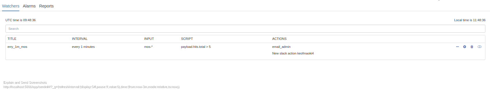

# Sentinl watcher tutorial

- [Sentinl documentation](http://sentinl.readthedocs.io/en/latest/)
- [Sentinl github](https://github.com/sirensolutions/sentinl)

## Content
- [Versions](#versions)
- [What is a watcher](#what-is-a-watcher)
- [How to use Sentinl watchers](#how-to-use-sentinl-watchers)
- [First Watcher](#first-watcher)
- [Understanding the Sentinl UI](#understanding-the-sentinl-ui)
- [Editing your alarm](#editing-your-alarm)
- [Date math](#date-math)
- [Guides and tutorials](#guides-and-tutorials)

## Versions
- This tutorial was created using the following versions of required software
  - Kibana 6.2.4
  - Elasticsearch 6.2.4
  - Sentinl 6.2.4
- Keep in mind that Sentinl is an open source project, and there is possibly bugs due to the high pace of Elastic and Elastic not keeping backward compatibility for plugins when releasing new versions.


## What is a watcher

- A watcher watches over your data, and based on your queries it will trigger an alert.
- How advanced an watcher is relies upon the user or admin of the system.

## How to use Sentinl watchers

- A Sentinl watcher could be used in several ways, the most intuitive way is to create one directly from a visualization or from a visualization saved in your dashboard.
  - In order to do this, you need to create a visualization of your data.
  - My data in all of the tutorials is a randomly generated ip, (Literally bash RANDOM and a timestamp).

- Important aspects:
	- Creating watchers from a visualization:
	- Visualization SPY in the bottom left corner of the visualization.  [Documentation](https://www.elastic.co/guide/en/kibana/current/vis-spy.html)
	-
	

	- Visualization SPY tab
  , Request, Response, Statistics]")

	- Watcher tab of Visualization SPY contains a single button which says "Set Alarm".
	- When that button is pressed the query which is generated from the visualization you are currently browsing is passed into a Watcher. (In order to see your query just switch to the request tab)
	- There is also a possibility to browse the response from the elasticsearch server, this could be useful when creating more advanced alerts that involves using JavaScript.

## First watcher

1. From the Visualization SPYs watcher tab click "Set Alarm"
1. You will be presented with a Sentinl watcher wizard.
	- This wizard uses the queries generated from your visualization in it's watcher operations (request tab)
	- The query is based on what you have selected in the time filter, but it will turn these timestamps into relative fields (e.g. "gte":"now-15m/m", "lte":"now/m")
	-


	- **Whether this interface looks like this or not is hard to predict, but we've submitted issues and pull requests with our desires. One of them is the dropdown in which you can specify is;  Is above, Is below and Equals.**
1. Specify  attributes for the watcher.
2. Press save and you should be redirected to the Sentinl UI. (The same UI as when you select Sentinl from the menu on the left. See [Understanding the Sentinl UI](#understanding-the-sentinl-ui))

## Understanding the Sentinl UI



- The Sentinl UI provides you with the basics of **monitoring**, **creating**, **maintaining**, **updating**, **deleting** and **testing/executing** both watchers and reports.
- In the top right corner of the Sentinl UI there is two buttons, the one you will be using is New, which starts the process of creating a new watcher or alarm.
- When pressing "New" you will be presented with a window/drop down that lets you specify whether it's a new watcher or a new reporter that you wish to create.


#### Monitoring
- The basics of monitoring Sentinl watchers is in the Alarms tab. You can preview the format and looks of your alarms that have been run.
-


- Timestamp, Level, Action and Message are columns in the table, on the right side of each alarm is the possibility to expand and view its json format with the three dots button and delete the alarm. (**This does not delete watchers.**)
-

#### Creating
**WIP**
- In the the top right corner of the Sentinl UI there is two buttons, the one you will be using is **New**, which starts the process of creating a new watcher or reporter.
- When pressing **New** you will be presented with a window/drop down that lets you specify whether it's a new watcher or a new reporter that you wish to create.
- Creating a watcher from scratch is not a simple task, luckily there are ways to avoid manually creating queries.
- The visualization SPY is worth using in this case. Just to get the simplest of structure in your manually created alert.
- Below is your starting point for manually creating an alert.
```json
{
  "search": {
    "request": {
      "index": [],
      "body": {}
    }
  }
}
```
- It's not much to start with. But using the query from the visualization SPY could speed up things. Below is an example query.

<!--- TODO add contents of spy vis query -->
```json

```
- So when merging the template with your query theres still some fields that require input. These are:
  - Index (Elasticsearch index pattern)
    - e.g. ```logstash-2018.06.20```
    - This is an array, so multiple fields are allowed. e.g
    ```json
    "request": {
        "index": [
          "logstash-2018.06.19",
          "logstash-2018.06.20"
        ]
      }
      ```
  - Relative timestamps 

<!--- TODO show a merge of the template and query from spy vis -->
```json

```

## Editing your alarm


## Date math


https://www.elastic.co/guide/en/elasticsearch/reference/6.2/date-math-index-names.html


## Guides and tutorials
- [Threshold alerting](threshold_alert.md)
- [Anomaly alerting](anomaly_alert.md)
- [Cardinality alerting](cardinality_alert.md)
- [Frequently asked questions](FAQ.md)
